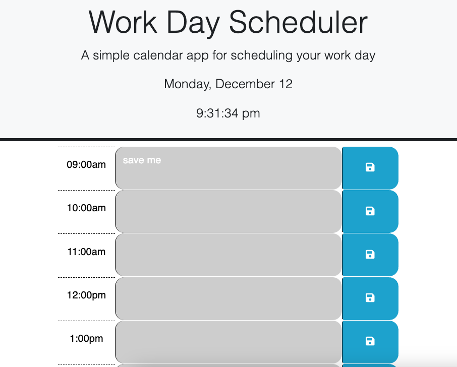
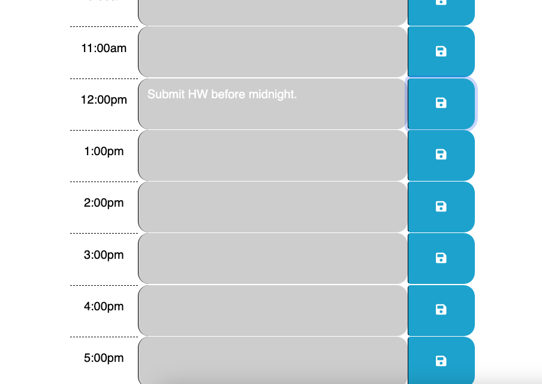

# Daily-planner
This is a repo that provides an application that allows you to plan your day and store the data locally.

## Description

Managing your daily tasks can be daunting. Studies show that if you can organize yourself and plan your tasks out, your have a greater chance of completing your tasks on time. I started this project because I wanted to create an app that allows me to track my daily tasks and store that data locally. Making this daily planner app helps to keep those who use it on schedule and organized. While completing this project I strengthened my skillset with JQuery, Bootstrap, and deeping my understanding of JavaScript, HTML, and CSS. 

## Table of Contents (Optional)

If your README is long, add a table of contents to make it easy for users to find what they need.

- [Installation](#installation)
- [Usage](#usage)
- [Credits](#credits)
- [License](#license)
- [Features](#features)
- [How to Contribute](#how-to-contribute)
- [Tests](#tests)

## Installation

This project does not need any installation to run. Opening the webpage will run the app and automatically allow you to store the data locally while using the page. 

## Usage

Click on a time frame, add your task you wish to store and click the save icon to the right. This will store the data. You can then refresh the page and see that the data will remain. Please see the images below for reference. 

https://jerrybeau89.github.io/daily-planner/

## Credits

Starter code provided by UW Coding Bootcamp 2022. 

Bootstrap, DayJS and JQUERY code has been used as well. 

## License

MIT License

Copyright (c) 2022 Jerry Beau Baggett

Permission is hereby granted, free of charge, to any person obtaining a copy of this software and associated documentation files (the "Software"), to deal in the Software without restriction, including without limitation the rights to use, copy, modify, merge, publish, distribute, sublicense, and/or sell copies of the Software, and to permit persons to whom the Software is furnished to do so, subject to the following conditions:

The above copyright notice and this permission notice shall be included in all copies or substantial portions of the Software.

THE SOFTWARE IS PROVIDED "AS IS", WITHOUT WARRANTY OF ANY KIND, EXPRESS OR IMPLIED, INCLUDING BUT NOT LIMITED TO THE WARRANTIES OF MERCHANTABILITY, FITNESS FOR A PARTICULAR PURPOSE AND NONINFRINGEMENT. IN NO EVENT SHALL THE AUTHORS OR COPYRIGHT HOLDERS BE LIABLE FOR ANY CLAIM, DAMAGES OR OTHER LIABILITY, WHETHER IN AN ACTION OF CONTRACT, TORT OR OTHERWISE, ARISING FROM, OUT OF OR IN CONNECTION WITH THE SOFTWARE OR THE USE OR OTHER DEALINGS IN THE SOFTWARE.

## Features

This project features the ability to store local data and draws the current running time. 

## How to Contribute

IF you would like to contribute, please feel free to do so. You may do so by expanding the time frame, or allowing the app to take user input regarding their personal hours for users that do not follow a standard 9-5 job. 

## Tests

If you want to test the app, try filling out the time slots and saving data, then refresh the page and see the data remain. 